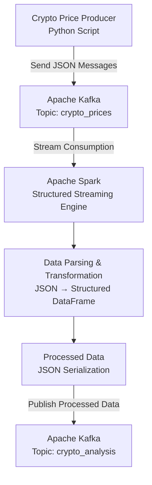

## 🏗️ System Architecture

```mermaid
flowchart TD

    A[Crypto Price Producer<br/>Python Script]
    B[Apache Kafka<br/>Topic: crypto_prices]
    C[Apache Spark<br/>Structured Streaming Engine]
    D[Data Parsing & Transformation<br/>JSON → Structured DataFrame]
    E[Processed Data<br/>JSON Serialization]
    F[Apache Kafka<br/>Topic: crypto_analysis]

    A -->|Send JSON Messages| B
    B -->|Stream Consumption| C
    C --> D
    D --> E
    E -->|Publish Processed Data| F
```
